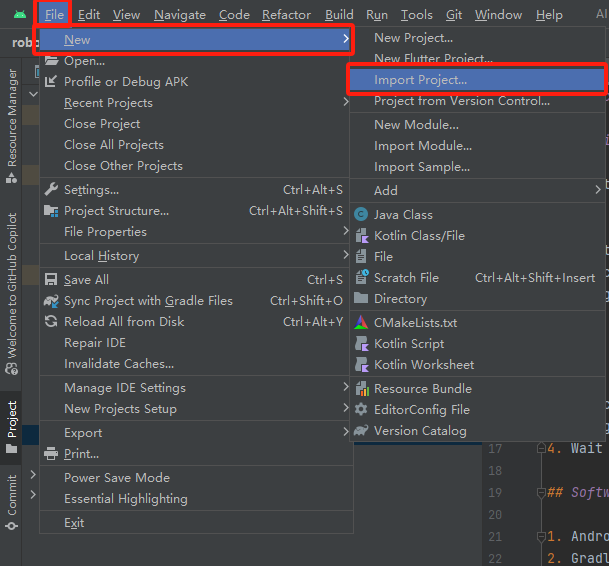

# Project Overview

## Cloning the Project Locally

Follow these steps to clone the project via HTTP:

1. Open the terminal or command line tool.
2. Run the following command to clone the repository:
3. git clone http://<your-repo-url>.git, replacing <your-repo-url> with the actual Git repository URL.
4. Navigate to the cloned project folder and open it in Android Studio.

# Steps to Import the Project

1. Open Android Studio.
2. Select File > New > Import Project.
3. Navigate to the directory containing the project, select the project folder, and click OK.
4. Wait for Android Studio to configure and sync the project.

## Software Environment Requirements

1. Android Studio version: 2022.3.1
2. Gradle version: 7.4
3. API level: 33
4. JBR (JetBrains Runtime): 17